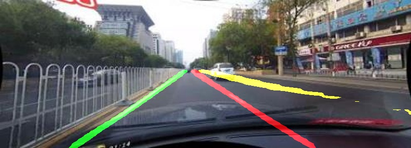

## 一、声明
SCNN是一种基于语义分割任务的车道检测算法, 论文出处['Spatial As Deep: Spatial CNN for Traffic Scene Understanding'](https://arxiv.org/abs/1712.06080). [官方提供](https://github.com/XingangPan/SCNN) 是lua实现的。<br/>
本项目基于官方开源代码，使用pytorch开发，做了一些精简和改动。

## 二、项目依赖安装
要运行本项目，第一步在本项目目录下输入命令，否则会报错：
```bash
pip install -r requirements.txt
```
上面命令不一定能安装成功一些库，需要自己在手动安装一次。具体安装哪些，参考"requirements.txt"
## 三、项目文件结构
```
SCNN_Pytorch-master
├── dataset
├── demo
├── experiments
└── utils
```
## 四、准备数据
### CULane
用户请自行下载数据集 [CULane](https://pan.baidu.com/s/1POTkcuV7roGq2_0gm9Ib8A) 提取码：wrcd
<br/>
下载解压文件，目录记为`CULane_path`. 在config.py中修改`CULane_path`对应取值。 在文件`utils/lane_evaluation/CULane/Run.sh`中修改 `data_dir`值为`CULane_path`对应的位置。
```
CULane_path
├── driver_100_30frame
├── driver_161_90frame
├── driver_182_30frame
├── driver_193_90frame
├── driver_23_30frame
├── driver_37_30frame
├── laneseg_label_w16
├── laneseg_label_w16_test
└── list
```
 **注意**
 上面文件结构中driver_23_30frame，下载的数据有两部分：driver_23_30frame_parrt1和driver_23_30frame_parrt2。需要将二者合并成driver_23_30frame,否则会报错。<br/>
合并方法：将driver_23_30frame_parrt1中driver_23_30frame复制到“CULane_path”下，再把driver_23_30frame_part2/driver_23_30frame中的所有内容剪切到“CULane_path/driver_23_30frame/“中即可。


### Tusimple
图森数据集 [Tusiple](https://pan.baidu.com/s/1VV-S8EJ3Z86WVQVS3qEkNA) 提取码:1234。下载并解压,路径即 `Tusimple_path`. 然后修改config.py中的`Tusimple_path`。
```
Tusimple_path
├── clips
├── label_data_0313.json
├── label_data_0531.json
├── label_data_0601.json
└── test_label.json
```
**注意："seg_label "images"和gt.txt，与CULane数据集格式一样，将在第一次实例化“Tusimple”对象时生成。比较耗时，请耐心等待。如果转化过程中因为其他原因错误，导致不能成功，情删除seg_label再试一次。**


<br/>

## 五、预训练模型下载


Culane数据集上的基于vgg模型使用[本书提供的模型](https://pan.baidu.com/s/1sBAxvm6I8o-cmhcneCmrWA) 
提取码：j6te
下载后模型存放位置 `experiments/vgg_SCNN_DULR_w9/vgg_SCNN_DULR_w9.pth`。目前已经是最新模型。

| Category  | F1-measure          |
| --------- | ------------------- |
| Normal    | 90.26               |
| Crowded   | 68.23               |
| HLight    | 61.84                |
| Shadow    | 61.16               |
| No line   | 43.44               |
| Arrow     | 84.64               |
| Curve     | 61.74               |
| Crossroad | 2728 （FP measure） |
| Night     | 65.32               |


* 在图森数据集上训练的结果[本书提供的模型](https://pan.baidu.com/s/1idK9IqfuagjaOnPq98aThA) 提取码t01m 下载后放入目录`experiments/exp0`.
下面是图森上SCNN的表现,这个训练很久。
  
| Accuracy | FP   | FN   |
| -------- | ---- | ---- |
| 94.16%   |0.0735|0.0825|


<br/>

## 六、训练 

1. 指定一个实验目录, 例如：`experiments/exp10`. 

2. 修改配置中的超参： `experiments/exp10/cfg.json`.

3. 开始训练:

   ```shell
   $ python train.py --exp_dir ./experiments/exp10 [--resume/-r]
   ```
   **注意**“--resume/-r”在原有保存好的模型的基础上训练。如果要自己训练，可以不带该参数，直接python train.py --exp_dir ./experiments/exp10

4. 使用tensorboard来查看训练情况:

   ```bash
   tensorboard --logdir='experiments/exp10'
   ```

**注意**

- 目前backbone使用的是torchvision下的vgg16。本案例对torchvision的vgg16模型进行了若干修改。最后三个conv层的膨胀更改为2。最后两个maxpooling层被删除（见model.py中net_init方法）。
- batch-size配置再cfg.json中，用户可以根据自己的硬件资源配置
<br/>

## 七、测试

目前实现单张图片测试:

```shell
python demo_test.py   -i demo/demo.jpg 
                      -w experiments/vgg_SCNN_DULR_w9/vgg_SCNN_DULR_w9.pth 
                      [--visualize / -v]
```
命令中 --visualize / -v加上是展示图片，不加上不展示图片分割结果。

<br/>
