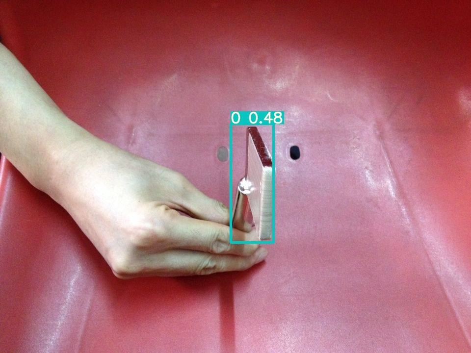

## 一、申明
本项目使用的是 ultralytics/yolov3 开源项目，基于pytorch开发，本书做了简化。用户也可以直接使用本项目。也可以自己下载原始项目。<br>
本项目下载后建议将本项目的目录名称修改为英文，因为我们数据集读取是用cv2读取，对于中文目录，不能识别，但不报错。
## 二、项目依赖安装
要运行本项目，第一步在本项目目录下输入命令，否则会报错：
```bash
pip install -r requirements.txt
```
上面命令不一定能安装成功一些库，需要自己在手动安装一次。例如：
```bash
$ pip install TensorBoard==2.2.1
```
具体安装哪些，参考"requirements.txt"
## 三、项目文件结构
```
8.9-yolov3
├── data
|    |——images
|    |——labels
|    |——hyp.scratch.yaml
|    └──tools.yaml
├── models
├── results
├── runs
├── utils
└── weights
```
其中，data用来存放数据的,包括images,labels，和两个yam文件。“hyp.scratch.yaml”是一些超参设置。“tools.yaml”中包含数据集在本项目的路径，以及类别总数，和类别名称。

## 四、准备数据
本项目使用的数据集存放在[百度云盘](https://pan.baidu.com/s/1Ijd75uACrjZMusPZJq-jlA) 
提取码：ecol <br/>
下载完本项目数据集后，解压，把解压后的data文件内的数据复制到本项目下"data"目录即可（项目文件结构中的data）
用户也可以根据书本上标注方法，在重新标注数据及放到data目录

## 五、使用自定义数据训练
### 训练

```bash
$ python train.py --data tools.yaml --cfg yolov3.yaml --weights weights/yolov3.weights --batch-size 24
                                         yolov3-spp.yaml                       24
                                         yolov3-tiny.yaml                      64
```
其中，<br/>
--batch是批次大小<br/>
--epochs是训练步数<br/>
--data后面是自定义数据的yaml文件。yaml文件放在本项目下“data/labels”目录中，用户可以根据自己数据集情况，自定义分类数量，类别名称。<br/>
--weights 后面参数是模型预训练权重路径。（可以不用这个权重自己训练）<br/>
--data 参数指定训练使用数据集配置，tools.yaml是我们自定义的数据配置<br/>
另外，在这个命令前，需要启动tensorboard，这样方便查看训练过程<br/>
--cfg后面参数就是指定yolov3的各个版本作为预训练模型。<br/>
另外 --cfg后面的xx.yam文件放在models目录下。<br/>
训练输出在runs/train/目录下的各个exp目录下，例如“exp17”是作者训练比较好的版本。权重是exp17/weights/best.pt，best.pt放在下面连接中。用户自己训练会生成新的exp文件。<br/>
预训练模型权重,和训练好的权重best.pt。用户可以下载[链接](https://pan.baidu.com/s/1_dc1e1T0ixiEbWqW9Q3sEQ) 提取码:1234

### 训练过程查看
```bash
$ tensorboard --logdir runs/train
```
网页查看
"http://localhost:6006/ "即可看到训练过程。

### 训练耗时
由于训练时比较耗时的，本数据集如果训练10轮，耗时需要近1天左右。希望用户耐心等待。（建议训练50-100轮）
## 六、检测阶段

使用训练好的模型检测图片
```bash
$ python detect.py --source 0  # 表示摄像头。
                            file.jpg  # 表示image，注意，命令行文件名不要有空格出现，我们的数据集中‘btdlt (1).jpg’中有空格需要操作一下：windows环境把路径用双引号包起来。linux用单引号
                            file.mp4  # 表示video
                            path/  # 表示目录
                            path/*.jpg  # 目录下所有图片
                            rtsp://170.93.143.139/rtplive/470011e600ef003a004ee33696235daa  # rtsp stream
                            rtmp://192.168.1.105/live/test  # rtmp stream
                            http://112.50.243.8/PLTV/88888888/224/3221225900/1.m3u8  # http stream
```
如果指定例如在data/images下图片进行操作:
```bash
$ python detect.py --source "data/images/train/btdlt (1).jpg" --conf 0.25
```
检测图片自动保存在runs/detect/中的exp...中
另外，为了展示图片检测效果，在detect.py中121行加入time.sleep(5)<br/>
